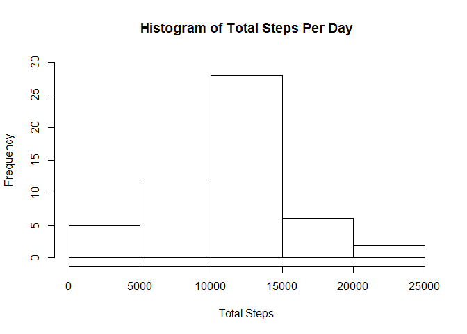
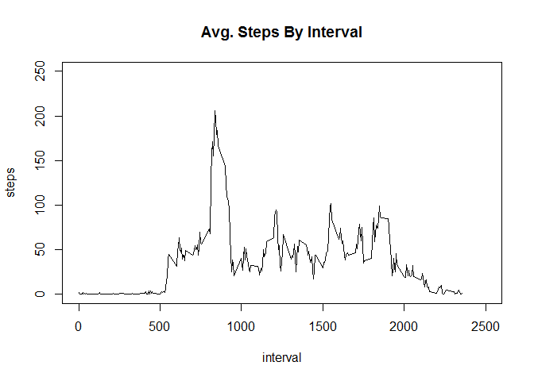
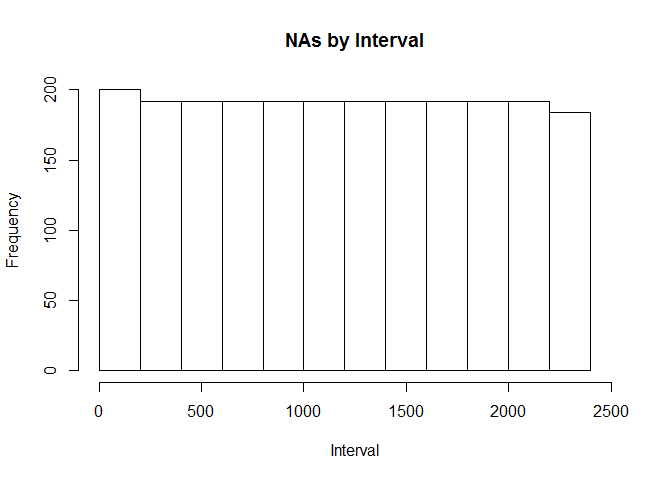
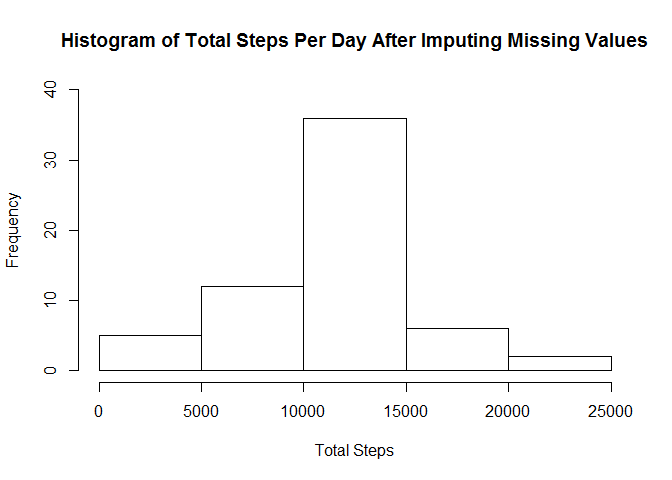
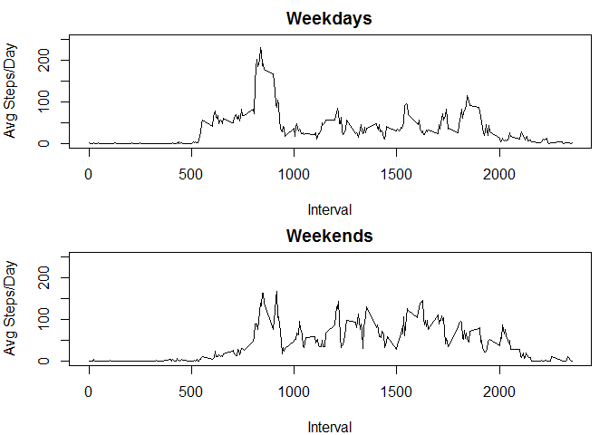

# Reproducible Reports Project 1
John Datovech  
August 19, 2017  


```r
knitr::opts_chunk$set(echo = TRUE)
```

This is my first report generated using R Markdown.  I am writing it to fulfill the requirements of Project 1 in the Reproducible Research course that is part of the Data Science specialization offered by Johns Hopkins University via Coursera.

This report is based upon a dataset named activity.csv that has been downloaded from course website.  This file contains data from a personal activity monitoring device. This device collects data at 5 minute intervals throughout the day. The data in this dataset consist of two months of data from an anonymous individual collected during the months of October and November, 2012 and include the number of steps taken in 5 minute intervals each day. 

This report will include text, chunks of code and plots.  For example, the chunk of code above sets a global option to display the chunks of code in the final html output report.  Displaying these chunks of code in the report is a requirement of the assignment.

#Load the Data


```r
        data<-read.csv("activity.csv")
```

#What is mean total number of steps taken per day?


```r
        stepsbyday<-aggregate(steps~date,data,sum)
        hist(stepsbyday$steps,main="Histogram of Total Steps Per Day",xlab="Total Steps",ylim=c(0,30))
```

<!-- -->

```r
        meansteps<-mean(stepsbyday$steps)
        mediansteps<-median(stepsbyday$steps)
```

The mean number of steps per day is 1.0766189\times 10^{4}.

The median number of steps per day is 10765.

Note that these two measures of central tendency are very close.

#What is the average daily activity pattern?


```r
        stepsbyinterval<-aggregate(steps~interval,data,mean)
        plot(stepsbyinterval,type="l",xlim=c(0,2500),ylim=c(0,250),main="Avg. Steps By Interval")
```

<!-- -->

```r
        maxinterval<-stepsbyinterval[which.max(stepsbyinterval$steps),]
        maxintervalnumber<-maxinterval[1,1]
        maxintervalsteps<-maxinterval[1,2]
```

On average, the interval with the most steps is number 835.

The average number of steps during this interval is 206.1698113.

#Imputing missing values

First, I see what the distribution of NAs looks like.  


```r
        NAs<-subset(data,is.na(data$steps))
        missing<-nrow(NAs)
        hist(NAs$interval,main="NAs by Interval",xlab="Interval",xlim=c(0,2500))
```

<!-- -->
 
From this histogram, it is clear the NAs, of which there are 2304 in the dataset, are almost evenly distributed by interval.  So, the strategy I will use will be to simply use the average (mean) value for a given interval as the value to substitute for the NA. 


```r
        avg_steps<-rep(NA,nrow(data))
        data2<-data.frame(data,avg_steps)
        data2$avg_steps<-stepsbyinterval$steps[match(data2$interval,stepsbyinterval$interval)]
        data2 <- transform(data2, steps = ifelse(!is.na(steps), steps, avg_steps))
        data2$avg_steps<-NULL
        stepsbyday2<-aggregate(steps~date,data2,sum)
        hist(stepsbyday2$steps,main="Histogram of Total Steps Per Day After Imputing Missing Values",xlab="Total Steps",ylim=c(0,40))
```

<!-- -->

```r
        meansteps2<-mean(stepsbyday2$steps)
        mediansteps2<-median(stepsbyday2$steps)
```

After imputing missing values by using the average value for a given time interval, the mean number of steps per day is 1.0766189\times 10^{4} and the median is 1.0766189\times 10^{4}.  Because I used this strategy to impute the missing values, the average did not change, and the median after imputing the missing values is the same as the mean.

#Are there differences in activity patterns between weekdays and weekends?


```r
        week_day<-weekdays(as.Date(data2$date,format="%Y-%m-%d"))
        data2<-data.frame(data2,week_day)
        part_of_week<-ifelse(data2$week_day=="Saturday"|data2$week_day=="Sunday","weekend","weekday")
        data2<-data.frame(data2,part_of_week)
        stepsbyinterval2<-aggregate(steps~interval+part_of_week,data2,mean)
        wd<-subset(stepsbyinterval2,part_of_week=="weekday",select=c(interval,steps))
        we<-subset(stepsbyinterval2,part_of_week=="weekend",select=c(interval,steps))
        par(mfcol=c(2,1),mar=c(4,4,2,1))
        plot(x=wd$interval,y=wd$steps,type="l",ylim=c(0,250),xlab="Interval",ylab="Avg Steps/Day",main="Weekdays")
        plot(x=we$interval,y=we$steps,type="l",ylim=c(0,250),xlab="Interval",ylab="Avg Steps/Day",main="Weekends")
```

<!-- -->

        
